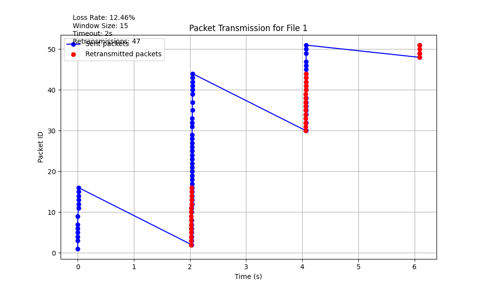

# File Transfer Simulation Project

This project simulates a file transfer system using UDP sockets in Python. It consists of a sender and receiver implementation that handles file transmission, packet acknowledgment, retransmissions, and loss simulation.

## Project Structure
  ├── receiver.py # Receiver implementation <br>
  ├── sender.py # Sender implementation <br>
  ├── images/ # Folder for input and output images <br>


## Features

- **Sender**:
  - Reads image files and divides them into packets.
  - Simulates packet loss using a configurable loss rate.
  - Implements a sliding window protocol for reliable transmission.
  - Retransmits lost packets after a timeout.
  - Generates transmission plots for visualization.

- **Receiver**:
  - Receives packets and sends acknowledgments.
  - Handles out-of-order packets and discards duplicates.
  - Reconstructs the file from received packets.
  - Calculates and displays transfer statistics.

- **Images Folder**:
  - The `images/` folder is used to store input files, received files, and transmission plots. It is empty by default and will be populated during the execution of the project.


## How to Run

1. **Setup**:
   - Ensure Python 3.10+ is installed.
   - Install required libraries:
     ```bash
     pip install matplotlib
     ```

2. **Run the Receiver**:
   - Start the receiver script:
     ```bash
     python receiver.py
     ```

3. **Run the Sender**:
   - Start the sender script:
     ```bash
     python sender.py
     ```

4. **Follow Prompts**:
   - The sender will prompt you to start transferring each file. (Press Enter to start sending each images)

## Configuration

- **Sender**:
  - `LOSS_RATE`: Simulates packet loss (default: random between 5% and 15%).
  - `N`: Sliding window size (default: 15).
  - `TIMEOUT`: Timeout for retransmissions (default: 2 seconds).
  - File paths for transmission are defined in the `files` list.

- **Receiver**:
  - `RECEIVER_PORT`: Port for receiving packets (default: 5200).
  - Output file paths are defined in the `file_paths` list.

## Output

- **Received Files**:
  - Files are saved as `received_file1.jpeg`, `received_file2.jpeg`, and `received_file3.jpeg`.

- **Transmission Plots**:
  - Plots showing sent and retransmitted packets are saved as `file_1_transmission_plot.png`, `file_2_transmission_plot.png`, and `file_3_transmission_plot.png`.

- **Statistics**:
  - Both sender and receiver display transfer statistics, including elapsed time, transfer rates, and retransmissions.

## Example Transmission Plot



## Notes

- This project is for educational purposes and demonstrates concepts like UDP communication, sliding window protocol, and packet loss handling.
- Ensure the sender and receiver are running on the same machine or network for proper communication.

## License

This project is licensed under the MIT License.